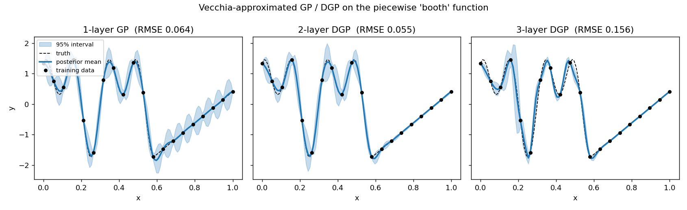

[](https://github.com/jdtuck/vecdgp/actions/workflows/Build.yml)

# vecdgp — Vecchia-approximated deep Gaussian processes in Python

A from-scratch Python implementation of

> A. Sauer, A. Cooper and R. B. Gramacy (2023).
> **Vecchia-approximated Deep Gaussian Processes for Computer Experiments.**
> *Journal of Computational and Graphical Statistics* — [arXiv:2204.02904](https://arxiv.org/abs/2204.02904)

ported against the authors' reference R package
[`deepgp`](https://cran.r-project.org/package=deepgp) (v1.2.3) called with
`vecchia = TRUE`.

The package gives you fully-Bayesian one-, two- and three-layer GPs whose MCMC
cost is **`O(n m³)` per sweep — linear in `n`** instead of the `O(n³)` of a
dense deep GP.

```
n =    500     0.045 s / MCMC sweep
n =   1000     0.082 s / MCMC sweep
n =   2000     0.165 s / MCMC sweep
n =   4000     0.346 s / MCMC sweep
n =   8000     0.665 s / MCMC sweep

empirical cost ~ n^0.99        (theory n^1.00; dense DGP n^3)
```

(two-layer DGP, m = 25, d = 2, on a 2-core box; see
[Performance](#performance) for how this compares with hand-written C++)

## Install

```bash
pip install numpy scipy numba matplotlib      # numba is optional but ~100x faster
cd vecdgp && pip install -e .
```

## Use

```python
import numpy as np
from vecdgp import fit_two_layer, rmse, crps

# x scaled to [0,1]^d, y standardised — the default priors assume this
x  = np.linspace(0, 1, 200)[:, None]
y  = np.where(x.ravel() <= 0.58,
              np.sin(np.pi*x.ravel()*6) + np.cos(np.pi*x.ravel()*12),
              5*x.ravel() - 4.9)
y  = (y - y.mean()) / y.std()

fit = fit_two_layer(x, y, nmcmc=10000, true_g=1e-6, m=25, seed=0)
fit = fit.trim(burn=5000, thin=5)          # drop burn-in, thin

xp   = np.linspace(0, 1, 500)[:, None]
pred = fit.predict(xp)                     # point-wise ("lite")
pred.mean, pred.s2

pred = fit.predict(xp, lite=False)         # joint: full predictive covariance
pred.Sigma
```

The R equivalent is

```r
fit <- deepgp::fit_two_layer(x, y, nmcmc = 10000, true_g = 1e-6,
                             vecchia = TRUE, m = 25)
fit <- trim(fit, 5000, 5)
p   <- predict(fit, xp, lite = TRUE)
```

## What the method does

**Vecchia approximation.** Order the observations at random (Guinness 2018) and
factorise `p(Y) = Π p(yᵢ | Y_{c(i)})` with each conditioning set `c(i)` the
`min(m, i-1)` *previous* points nearest to `xᵢ`. This makes the precision
matrix sparse, `Q = U Uᵀ`, with the entries of the upper-triangular `U` read
straight off small `(m+1)×(m+1)` Cholesky factors (Katzfuss & Guinness 2021,
Prop. 1) — no `n×n` inverse is ever formed.

Everything the sampler needs follows from `U`:

| quantity | how |
| --- | --- |
| log-likelihood | `Σ log Uᵢᵢ − ½‖Uᵀ(y−μ)‖²` |
| prior draw | `z ~ N(0,I)`, solve `Uᵀ y = z` (forward substitution) |
| joint prediction | partition `U_stack`: `μ* = −U*⁻ᵀ U_{w,*}ᵀ y`, `Σ* = (U* U*ᵀ)⁻¹` |

**Deep GP.** A two-layer model maps `X → W → Y`, with `W` an `n×D` latent
matrix of independent GPs; a three-layer model inserts `X → Z → W → Y`. Each
layer carries its own Vecchia approximation. The latent layers use `τ² = 1`
and a nugget of `eps`, for parsimony.

**Inference.** One Gibbs sweep:

1. Metropolis-Hastings on the nugget `g` (skipped when `true_g` is set),
2. MH on the outer lengthscale `θ_y`,
3. MH on each inner lengthscale `θ_w[k]` (and `θ_z[k]`),
4. elliptical slice sampling of the latent layers.

Proposals are uniform sliding windows `Unif(l·v/u, u·v/l)`; priors are
`Gamma(α, rate=β)`; `τ²` is integrated out analytically under a reference
prior, so the outer likelihood is the profile `Σ log Uᵢᵢ − (n/2) log(quad)`.
Prior draws for slice sampling come from the forward solve above, which is
what makes ESS affordable at scale.

**Prediction.** `lite=True` gives independent point-wise predictions, each
from its own `m`-nearest-neighbour set recomputed in the *warped* space
`W⁽ᵗ⁾` at every MCMC draw (the paper's recommendation for dense test sets).
`lite=False` builds a stacked sparse `U` and returns the full predictive
covariance. Draws are combined by the law of total variance.

## Layout

```
vecdgp/
  kernels.py    Matérn (ν = ½, 3/2, 5/2) and squared-exponential; isotropic + separable
  vecchia.py    orderings, ordered-NN search, U entries, forward solve, prior draws
  mcmc.py       Vecchia log-likelihood, MH samplers, elliptical slice sampling
  gibbs.py      the 1-/2-/3-layer Gibbs sweeps
  krig.py       point-wise, joint, and sequential-sample prediction
  predict.py    averaging over MCMC draws, latent-layer mapping
  fit.py        fit_one_layer / fit_two_layer / fit_three_layer, trim, model objects
  settings.py   deepgp's default priors and proposal windows
  metrics.py    rmse / crps / score, safe_cholesky
  diagnose.py   `python -m vecdgp.diagnose` environment + numerical self-check
examples/
  demo_booth.py    the deepgp vignette's 1-D nonstationary example
  demo_scaling.py  timing vs n, fits the exponent
tests/
  test_vecdgp.py   30 tests
bench/
  ubench.cpp       C++/OpenMP transliteration of u_entries
  run_bench.py     races numba against it
  opt_numba.py     isolates the two loop-shape optimisations
```

## Correctness

Run `pytest tests -q` (30 tests, ~20 s). The core idea: **when `m = n − 1` the
Vecchia approximation is exact**, so every approximated quantity must
reproduce the dense-GP calculation to machine precision.

- `U Uᵀ Σ = I` to ~1e-9, for all four kernels and for separable lengthscales.
- `logl_vec` equals `scipy.stats.multivariate_normal.logpdf` (up to the dropped
  `−n/2 log 2π`) to 1e-9 relative; the profiled version and `τ̂²` match their
  closed forms.
- Approximation error decreases monotonically in `m` (`m = 3, 10, 30, n−1`).
- Forward solve and `Uᵀv` agree with dense triangular algebra to 1e-9.
- 40 000 prior draws reproduce `Σ` (and a non-zero prior mean) empirically.
- Point-wise and joint prediction both reproduce exact kriging means and
  variances at full `m`, and agree with each other.
- 30 000 sequential posterior samples reproduce the joint predictive mean and
  covariance.
- `score` matches `multivariate_normal.logpdf` to 1e-9, and stays finite and
  warning-free on a covariance whose determinant underflows to zero.
- End-to-end: the two-layer DGP beats the one-layer GP on RMSE **and** CRPS on
  the vignette's piecewise function; nugget estimation recovers a known noise
  level.



Note the one-layer GP's oscillating, inflated intervals over the linear
regime — the stationarity artefact the paper is about — and how the two-layer
DGP tightens them.

## Performance

**Would C++ be faster? No.** `bench/ubench.cpp` is a straight C++/OpenMP
transliteration of `u_entries` — the hot kernel, ~85% of MCMC time — compiled
`-O3 -march=native`, with per-thread scratch buffers hoisted out of the row
loop. Timings for building the whole factor `U` (m = 25, d = 2, 2 cores):

| n | numba | C++/OpenMP |
| --- | --- | --- |
| 1 000 | 3.0 ms | 3.5 ms |
| 5 000 | 15.2 ms | 17.7 ms |
| 20 000 | 61.0 ms | 71.3 ms |
| 50 000 | **157.8 ms** | 181.3 ms |

Both go through LLVM, so this is the expected answer: for dense numeric loops
with no Python objects in them, numba and C++ emit comparable code, and here
numba edges ahead. Reproduce with `bench/run_bench.py` (needs `g++`).

What *did* matter was the shape of the loops, not the language. Two fixes,
found by profiling, gave **4.4x** on the kernel and **4.0x** end-to-end:

1. **Hoist the kernel dispatch out of the inner loop.** The original
   `fill_cov` branched on `v` and `sep` per matrix element. Splitting into a
   distance pass and a kernel pass, each with the branch outside the loops,
   was worth ~2.1x.
2. **Exploit symmetry.** `_chol_lower` reads only the lower triangle, so
   evaluating the upper one doubled the `exp`/`sqrt` count for nothing —
   another ~1.6x. Those transcendentals, not the Cholesky, dominate: a 26×26
   block is ~350 `exp` calls against ~5 900 flops of factorisation.

`bench/opt_numba.py` isolates both effects. Results are unchanged to ~1e-8 and
the test suite still passes, so this is pure overhead removal.

Remaining headroom, in rough order of value: SIMD-vectorised transcendentals
(numba picks these up automatically when Intel SVML is importable — untested
here, as it would not load on this box); caching `U` across the MH steps that
reject; and more cores, since the row loop is embarrassingly parallel and this
box had only two.

## Troubleshooting

```bash
python -m vecdgp.diagnose
```

prints your numpy/scipy/numba versions and BLAS backend, then runs the core
exactness identities and reports the actual error magnitudes. Any numerical
warning is captured and shown rather than swallowed.

**`RuntimeWarning: divide by zero / overflow / invalid value encountered in
slogdet`** — fixed in 0.1.1. `score()` used the general LU-based
`np.linalg.slogdet` + `solve` on a matrix that is always symmetric positive
definite. The determinant of a GP covariance underflows extremely fast (`det`
of a 50×50 predictive covariance is ~1e-92, and it reaches exactly 0.0 by
n=150) while the matrix is still perfectly well conditioned, so whether LU
hits a zero pivot depends on the LAPACK build — it warns under MKL, which
Anthropic ships in Anaconda, but not under the OpenBLAS in a pip numpy. Both
`score()` and the test suite now use Cholesky, which is the right
factorisation for an SPD matrix and cannot reach that code path. Only the
*log* determinant is ever formed.

**Anything else calling `det`/`slogdet`/`inv` on a covariance.** Don't. Every
covariance here is SPD, so Cholesky is always the right tool. The test suite
now promotes numpy's divide-by-zero / overflow / invalid-value warnings to
errors (see `[tool.pytest.ini_options]`), so a regression fails loudly on
whichever LAPACK you happen to have rather than warning on only some of them.

**Results differ slightly between machines.** Expected, and small: the MCMC is
seeded through `numpy.random.Generator`, so it is reproducible for a fixed
seed *on a fixed BLAS*, but the covariance assembly and Cholesky reorder
floating-point operations differently across backends. Divergence should be at
the 1e-12 level per operation. `python -m vecdgp.diagnose` will tell you if it
is larger than that.

**Very slow.** Check `vecdgp using numba: True` in the diagnostic. Without
numba every kernel falls back to interpreted loops.

## Scope

Implemented: one/two/three layers, Matérn ν ∈ {½, 3/2, 5/2} and squared
exponential, isotropic and separable (ARD) lengthscales, estimated or fixed
nugget, `D`-wide latent layers, `pmx` (prior mean `x` on the latent layer),
random or user-supplied orderings, point-wise / joint / sequential-sample
prediction, `mean_map` on or off, trim & thin, RMSE / CRPS / score.

Not ported (they belong to later `deepgp` releases rather than to
arXiv:2204.02904): gradient-enhanced fitting and gradient prediction,
monotonic warpings (`monowarp`), and the sequential-design criteria
(ALC, IMSE, EI, entropy).

Two deliberate deviations from `deepgp`, both immaterial to the posterior:

- When no ordering is supplied, one random ordering is drawn and **shared**
  across layers, as the paper describes; `deepgp` draws one per layer.
- Parallelism uses numba's `prange` over the rows of `U` where the R package
  uses OpenMP; with `VECDGP_DISABLE_NUMBA=1` the package still runs, in pure
  Python.

Elliptical slice sampling with a non-zero prior mean (`pmx=True`) rotates the
mean along with the draw, exactly as `deepgp` does; this is a slight departure
from textbook ESS and is preserved here for fidelity to the reference.

## References

- Sauer, Cooper & Gramacy (2023). *Vecchia-approximated Deep Gaussian
  Processes for Computer Experiments.* JCGS. arXiv:2204.02904.
- Sauer, Gramacy & Higdon (2023). *Active learning for deep Gaussian process
  surrogates.* Technometrics.
- Katzfuss & Guinness (2021). *A general framework for Vecchia approximations
  of Gaussian processes.* Statistical Science.
- Guinness (2018). *Permutation and grouping methods for sharpening Gaussian
  process approximations.* Technometrics.
- Murray, Adams & MacKay (2010). *Elliptical slice sampling.* AISTATS.
- Vecchia (1988). *Estimation and model identification for continuous spatial
  processes.* JRSS-B.
