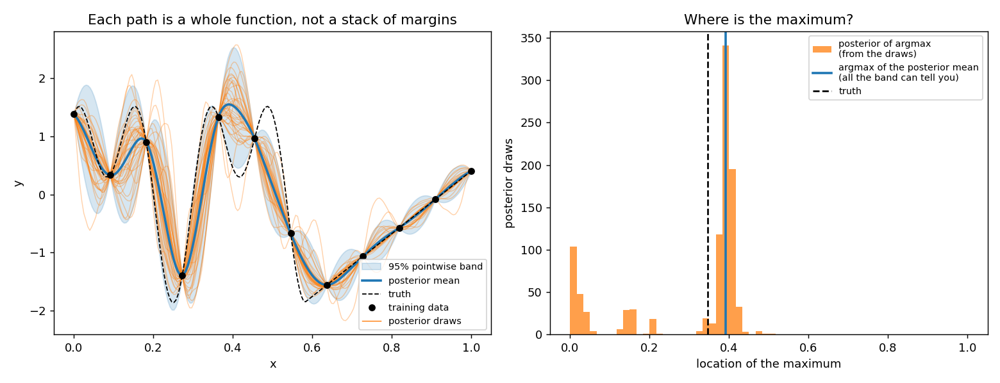

[](https://github.com/jdtuck/vecdgp/actions/workflows/Build.yml)

# vecdgp — Vecchia-approximated deep Gaussian processes in Python

A from-scratch Python implementation of

> A. Sauer, A. Cooper and R. B. Gramacy (2023).
> **Vecchia-approximated Deep Gaussian Processes for Computer Experiments.**
> *Journal of Computational and Graphical Statistics* — [arXiv:2204.02904](https://arxiv.org/abs/2204.02904)

ported against the authors' reference R package
[`deepgp`](https://cran.r-project.org/package=deepgp) (v1.2.3) called with
`vecchia = TRUE`.

The package gives you fully-Bayesian one-, two- and three-layer GPs whose MCMC
cost is **`O(n m³)` per sweep — linear in `n`** instead of the `O(n³)` of a
dense deep GP.

```
n =    500     0.031 s / MCMC sweep
n =   1000     0.061 s / MCMC sweep
n =   2000     0.123 s / MCMC sweep
n =   4000     0.259 s / MCMC sweep
n =   8000     0.496 s / MCMC sweep

empirical cost ~ n^1.01        (theory n^1.00; dense DGP n^3)
```

(two-layer DGP, m = 25, d = 2, on a 2-core box; see
[Performance](#performance) for how this compares with hand-written C++)

## Install

```bash
pip install numpy scipy numba matplotlib      # numba is optional but ~100x faster
cd vecdgp && pip install -e .
```

## Use

```python
import numpy as np
from vecdgp import fit_two_layer, rmse, crps

# x scaled to [0,1]^d, y standardised — the default priors assume this
x  = np.linspace(0, 1, 200)[:, None]
y  = np.where(x.ravel() <= 0.58,
              np.sin(np.pi*x.ravel()*6) + np.cos(np.pi*x.ravel()*12),
              5*x.ravel() - 4.9)
y  = (y - y.mean()) / y.std()

fit = fit_two_layer(x, y, nmcmc=10000, true_g=1e-6, m=25, seed=0)
fit = fit.trim(burn=5000, thin=5)          # drop burn-in, thin

xp   = np.linspace(0, 1, 500)[:, None]
pred = fit.predict(xp)                     # point-wise ("lite")
pred.mean, pred.s2

pred = fit.predict(xp, lite=False)         # joint: full predictive covariance
pred.Sigma

paths = fit.post_sample(xp)                # joint posterior sample paths
paths.shape                                # (nmcmc, len(xp)) -- one per draw
```

`predict` summarises; `post_sample` draws whole functions. Use the paths for
anything that is a *functional* of the surface rather than a pointwise
summary — the distribution of the argmax, threshold-crossing or excursion
probabilities, or propagating surrogate uncertainty into a downstream
calculation. A pointwise band cannot express those, because they depend on how
the uncertainty at one location correlates with the next:



The posterior over the argmax is clearly multi-modal — about a third of the
draws put the maximum somewhere other than the mode. The posterior mean gives
you one number and no way to see that.

Sampling is sequential over test locations (paper, Sec. 3.4): each location
conditions on the training data *and* on the locations already drawn in that
path, so no dense `n_new x n_new` covariance is ever formed. `nper` raises the
draws per MCMC iteration; `mean_map=False` additionally samples the latent
layer rather than using its conditional mean.

The R equivalent is

```r
fit <- deepgp::fit_two_layer(x, y, nmcmc = 10000, true_g = 1e-6,
                             vecchia = TRUE, m = 25)
fit <- trim(fit, 5000, 5)
p   <- predict(fit, xp, lite = TRUE)
```

## One sample at a time

Calibration is the other shape entirely: one location, one sample, a hundred
thousand times. `post_sample` is built for many locations and every retained
draw at once, and at that size nearly all of its time goes on per-call setup
over the *training* set — a KD-tree over all `n` points, re-ordering the latent
layer, allocating `(n, m+1)` conditioning arrays. None of it depends on the
point being evaluated, so `fit.sampler()` hoists it out and memoises it per
posterior draw:

```python
emu = fit.sampler()
rng = np.random.default_rng(0)
for step in range(100_000):
    t = rng.integers(emu.nmcmc)              # new posterior draw each step
    y = emu.sample(theta_proposed, draw=t, rng=rng)   # (1, 1)
    ...                                      # accept/reject on y
```

Holding `t` fixed gives a plug-in emulator instead — cheaper in variance, but
the calibration posterior is then conditional on one emulator fit rather than
integrating over emulator uncertainty. That is a statistical choice, not a
performance one: the two cost the same (see the table below).

`emu.mean_sd(x, draw=t)` returns the moments without drawing, for a plug-in
likelihood. It is bit-identical to `predict(x, draws=t)`, which is the point —
this is the same calculation, not a cheaper approximation.

n = 6000, d = 2, m = 25, one location, a fresh posterior draw each iteration
(`bench/calibration.py`):

| route | µs/evaluation | ×100k iterations |
|---|---|---|
| `post_sample()` — all draws, keep one | 100 000 | 2.8 h |
| `post_sample(draws=t)` | 3 678 | 6.1 min |
| `emu.sample(draw=t)` | 312 | 31 s |

Two counts matter, and they behave differently:

**Samples per call (`nper`).** The setup is paid once however many you ask
for, so cost per sample falls to a floor — that floor is what the sequential
draw alone costs.

| `nper` | 1 | 10 | 100 | 1 000 | 10 000 |
|---|---|---|---|---|---|
| µs/sample | 286 | 68 | 43 | 41 | 38 |

So ~275 µs of a single-sample call is setup and ~38 µs is the draw. If your
outer loop can batch — several proposals at once, or several emulator
replicates per proposal — it is nearly free to do so.

**Posterior draws visited.** Warm, the per-evaluation cost is flat at
~280–290 µs whether the loop revisits one draw or all forty, because the only
per-draw work is a KD-tree built the first time that draw is seen. Warming all
40 draws costs 71 ms once, or 0.71 µs/iteration amortised over 100k. Being
fully Bayesian about the emulator is free here.

The cache holds one KD-tree per visited draw (a few hundred kB each at
n = 6000); `fit.sampler(max_cached=...)` bounds it, evicting first-in.

```bash
python bench/calibration.py              # n=6000, d=2, m=25
python bench/calibration.py 20000 2 25   # your own size
```

## What the method does

**Vecchia approximation.** Order the observations at random (Guinness 2018) and
factorise `p(Y) = Π p(yᵢ | Y_{c(i)})` with each conditioning set `c(i)` the
`min(m, i-1)` *previous* points nearest to `xᵢ`. This makes the precision
matrix sparse, `Q = U Uᵀ`, with the entries of the upper-triangular `U` read
straight off small `(m+1)×(m+1)` Cholesky factors (Katzfuss & Guinness 2021,
Prop. 1) — no `n×n` inverse is ever formed.

Everything the sampler needs follows from `U`:

| quantity | how |
| --- | --- |
| log-likelihood | `Σ log Uᵢᵢ − ½‖Uᵀ(y−μ)‖²` |
| prior draw | `z ~ N(0,I)`, solve `Uᵀ y = z` (forward substitution) |
| joint prediction | partition `U_stack`: `μ* = −U*⁻ᵀ U_{w,*}ᵀ y`, `Σ* = (U* U*ᵀ)⁻¹` |

**Deep GP.** A two-layer model maps `X → W → Y`, with `W` an `n×D` latent
matrix of independent GPs; a three-layer model inserts `X → Z → W → Y`. Each
layer carries its own Vecchia approximation. The latent layers use `τ² = 1`
and a nugget of `eps`, for parsimony.

**Inference.** One Gibbs sweep:

1. Metropolis-Hastings on the nugget `g` (skipped when `true_g` is set),
2. MH on the outer lengthscale `θ_y`,
3. MH on each inner lengthscale `θ_w[k]` (and `θ_z[k]`),
4. elliptical slice sampling of the latent layers.

Proposals are uniform sliding windows `Unif(l·v/u, u·v/l)`; priors are
`Gamma(α, rate=β)`; `τ²` is integrated out analytically under a reference
prior, so the outer likelihood is the profile `Σ log Uᵢᵢ − (n/2) log(quad)`.
Prior draws for slice sampling come from the forward solve above, which is
what makes ESS affordable at scale.

**Prediction.** `lite=True` gives independent point-wise predictions, each
from its own `m`-nearest-neighbour set recomputed in the *warped* space
`W⁽ᵗ⁾` at every MCMC draw (the paper's recommendation for dense test sets).
`lite=False` builds a stacked sparse `U` and returns the full predictive
covariance. Draws are combined by the law of total variance.

## Layout

```
vecdgp/
  kernels.py    Matérn (ν = ½, 3/2, 5/2) and squared-exponential; isotropic + separable
  vecchia.py    orderings, ordered-NN search, U entries, forward solve, prior draws
  mcmc.py       Vecchia log-likelihood, MH samplers, elliptical slice sampling
  gibbs.py      the 1-/2-/3-layer Gibbs sweeps
  krig.py       point-wise, joint, and sequential-sample prediction
  calibrate.py  cached per-draw sampler for one-location repeated draws
  predict.py    averaging over MCMC draws, latent-layer mapping
  fit.py        fit_one_layer / fit_two_layer / fit_three_layer, trim, predict, post_sample
  settings.py   deepgp's default priors and proposal windows
  metrics.py    rmse / crps / score, safe_cholesky
  diagnose.py   `python -m vecdgp.diagnose` environment + numerical self-check
examples/
  demo_booth.py    the deepgp vignette's 1-D nonstationary example
  demo_scaling.py  timing vs n, fits the exponent
  demo_post_sample.py  sample paths, and a functional a band cannot give you
tests/
  test_vecdgp.py   53 tests
bench/
  ubench.cpp       C++/OpenMP transliteration of u_entries
  run_bench.py     races numba against it
  opt_numba.py     isolates the two loop-shape optimisations
  opt_uentries.py  tests whether hoisting per-row allocations pays (it does not)
  scaling_cores.py measures core scaling on your machine
  calibration.py   per-evaluation latency for the one-sample-at-a-time loop
```

## Correctness

Run `pytest tests -q` (53 tests, ~30 s). The core idea: **when `m = n − 1` the
Vecchia approximation is exact**, so every approximated quantity must
reproduce the dense-GP calculation to machine precision.

- `U Uᵀ Σ = I` to ~1e-9, for all four kernels and for separable lengthscales.
- `logl_vec` equals `scipy.stats.multivariate_normal.logpdf` (up to the dropped
  `−n/2 log 2π`) to 1e-9 relative; the profiled version and `τ̂²` match their
  closed forms.
- Approximation error decreases monotonically in `m` (`m = 3, 10, 30, n−1`).
- Forward solve and `Uᵀv` agree with dense triangular algebra to 1e-9.
- 40 000 prior draws reproduce `Σ` (and a non-zero prior mean) empirically.
- Point-wise and joint prediction both reproduce exact kriging means and
  variances at full `m`, and agree with each other.
- 30 000 sequential posterior samples reproduce the joint predictive mean and
  covariance.
- `cores` is a pure speed knob: predictions and sample paths are bit-identical
  for any core count, on all three model depths.
- Every parallel path is exercised in a subprocess under numba's `workqueue`
  threading layer, which aborts on nested parallelism where `omp`/`tbb` do
  not — the configuration that broke macOS CI.
- `post_sample` paths reproduce `predict(lite=False)`'s mean and full
  covariance (off-diagonal correlation > 0.95), and match exact MVN draws from
  that covariance on a statistic sensitive to joint structure — one that also
  separates them from pointwise-independent draws.
- `score` matches `multivariate_normal.logpdf` to 1e-9, and stays finite and
  warning-free on a covariance whose determinant underflows to zero.
- End-to-end: the two-layer DGP beats the one-layer GP on RMSE **and** CRPS on
  the vignette's piecewise function; nugget estimation recovers a known noise
  level.


Note the one-layer GP's oscillating, inflated intervals over the linear
regime — the stationarity artefact the paper is about — and how the two-layer
DGP tightens them.

## Performance

**Would C++ be faster? No.** `bench/ubench.cpp` is a straight C++/OpenMP
transliteration of `u_entries` — the hot kernel, ~85% of MCMC time — compiled
`-O3 -march=native`, with per-thread scratch buffers hoisted out of the row
loop. Timings for building the whole factor `U` (m = 25, d = 2, 2 cores):

| n | numba | C++/OpenMP |
| --- | --- | --- |
| 1 000 | 3.0 ms | 3.5 ms |
| 5 000 | 15.2 ms | 17.7 ms |
| 20 000 | 61.0 ms | 71.3 ms |
| 50 000 | **157.8 ms** | 181.3 ms |

Both go through LLVM, so this is the expected answer: for dense numeric loops
with no Python objects in them, numba and C++ emit comparable code, and here
numba edges ahead. Reproduce with `bench/run_bench.py` (needs `g++`).

What *did* matter was the shape of the loops, not the language. Two fixes,
found by profiling, gave **4.4x** on the kernel and **4.0x** end-to-end:

1. **Hoist the kernel dispatch out of the inner loop.** The original
   `fill_cov` branched on `v` and `sep` per matrix element. Splitting into a
   distance pass and a kernel pass, each with the branch outside the loops,
   was worth ~2.1x.
2. **Exploit symmetry.** `_chol_lower` reads only the lower triangle, so
   evaluating the upper one doubled the `exp`/`sqrt` count for nothing —
   another ~1.6x. Those transcendentals, not the Cholesky, dominate: a 26×26
   block is ~350 `exp` calls against ~5 900 flops of factorisation.

`bench/opt_numba.py` isolates both effects. Results are unchanged to ~1e-8 and
the test suite still passes, so this is pure overhead removal.

Remaining headroom: SIMD-vectorised transcendentals. Numba picks these up
automatically via Intel SVML, which would plausibly be worth another 2-4x on
`u_entries` and therefore on everything. The blocker is **llvmlite, not the
SVML library** — LLVM has to be built with the SVML patch before it can emit
vectorised calls, and installing `libsvml.so` / `intel-cmplr-lib-rt` does
nothing on its own. One-line check:

```bash
python -c "import llvmlite.binding as b; print(b.targets.has_svml())"
```

`False` on the llvmlite here (0.49.0), which is why the gain is untested rather
than dismissed. `python -m vecdgp.diagnose` now reports this distinction
instead of a bare "SVML: False". After that: caching `U` across rejected MH
steps, and more cores — the row loop is embarrassingly parallel and this box
has only two.

## Troubleshooting

```bash
python -m vecdgp.diagnose
```

prints your numpy/scipy/numba versions and BLAS backend, then runs the core
exactness identities and reports the actual error magnitudes. Any numerical
warning is captured and shown rather than swallowed.

**`RuntimeWarning: divide by zero / overflow / invalid value encountered in
slogdet`** — fixed in 0.1.1. `score()` used the general LU-based
`np.linalg.slogdet` + `solve` on a matrix that is always symmetric positive
definite. The determinant of a GP covariance underflows extremely fast (`det`
of a 50×50 predictive covariance is ~1e-92, and it reaches exactly 0.0 by
n=150) while the matrix is still perfectly well conditioned, so whether LU
hits a zero pivot depends on the LAPACK build — it warns under MKL, which
Anthropic ships in Anaconda, but not under the OpenBLAS in a pip numpy. Both
`score()` and the test suite now use Cholesky, which is the right
factorisation for an SPD matrix and cannot reach that code path. Only the
*log* determinant is ever formed.

**`Fatal Python error: Aborted` during parallel prediction (macOS).** Fixed in
0.3.1. Numba's `parallel=True` kernels must not be entered from several Python
threads at once, and the draw-level thread pool did exactly that. The `omp`
and `tbb` threading layers tolerate it; `workqueue` -- numba's fallback, and
what a stock macOS install typically gets -- aborts the process with
"Concurrent access has been detected". Every parallel kernel now has a serial
twin, selected automatically inside the pool, so no nesting occurs on any
layer. **If you run CI, exercise both layers** -- this passed on Linux for a
release because `omp` happened to be available there:

```bash
pytest tests -q
NUMBA_THREADING_LAYER=workqueue pytest tests -q
```

**Anything else calling `det`/`slogdet`/`inv` on a covariance.** Don't. Every
covariance here is SPD, so Cholesky is always the right tool. The test suite
now promotes numpy's divide-by-zero / overflow / invalid-value warnings to
errors (see `[tool.pytest.ini_options]`), so a regression fails loudly on
whichever LAPACK you happen to have rather than warning on only some of them.

**Results differ slightly between machines.** Expected, and small: the MCMC is
seeded through `numpy.random.Generator`, so it is reproducible for a fixed
seed *on a fixed BLAS*, but the covariance assembly and Cholesky reorder
floating-point operations differently across backends. Divergence should be at
the 1e-12 level per operation. `python -m vecdgp.diagnose` will tell you if it
is larger than that.

**Very slow.** Check `vecdgp using numba: True` in the diagnostic. Without
numba every kernel falls back to interpreted loops.

## If it's slow

Measured at **n = 6000, d = 2, m = 25, two-layer, on a 2-core box**. Start with
`python -m vecdgp.diagnose`, which reports your thread count.

**1. Use your cores — there is now a `cores` argument everywhere.**

```python
fit   = fit_two_layer(x, y, nmcmc=10000, cores=16)   # numba threads
pred  = fit.predict(xp, cores=16)                    # + parallel over draws
paths = fit.post_sample(xp, cores=16)
```

`cores=None` (the default for prediction) uses everything available;
`cores=1` forces serial. **Results do not depend on `cores`** — one RNG
stream is spawned per MCMC draw rather than per worker, so every path is
bit-identical however you set it (there are tests pinning this).

Measured on a **40-core** machine, n = 6000, d = 2, m = 25 (`bench/scaling_cores.py`):

| cores | fit s/sweep | speedup | nmcmc = 10 000 |
| --- | --- | --- | --- |
| 1 | 0.643 | 1.00x | 1.79 h |
| 2 | 0.321 | 2.01x | 0.89 h |
| 4 | 0.167 | 3.86x | 0.46 h |
| 8 | 0.091 | 7.04x | 0.25 h |
| 16 | 0.065 | 9.87x | 0.18 h |
| 32 | 0.051 | **12.6x** | 0.14 h |
| 40 | 0.055 | 11.6x | 0.15 h |

**Scaling is near-linear to 8 cores, then flattens, and 40 is slower than 32.**
Past ~8 threads each gets only a few hundred of the 6000 rows, and numba's
fork/join cost across the ~20 parallel regions per sweep starts to dominate;
at 40 it overtakes the gain. Use **16–32**, not everything you have, and
re-measure at your own `n` — more rows push the sweet spot higher.

The two halves parallelise by different mechanisms, which is worth knowing:

The two halves parallelise by different mechanisms, which is worth knowing:

- **Fitting** can only use numba's `prange` over the rows of `U` — MCMC
  sweeps are a Markov chain and cannot be split. That parallelises almost
  perfectly, so fit time is close to inversely proportional to core count.
- **Prediction** adds a second, coarser axis: MCMC draws are independent, so
  they are spread over a thread pool. This matters because much of prediction
  is scipy KD-tree work and the sequential sampler, which `prange` cannot
  reach at all — numba threads alone take `post_sample` only 1.25x, and draw
  parallelism carries it the rest of the way to 1.67x.

A note on the prediction ladder: it uses only ~20 retained draws, and with
fewer draws than cores there is nothing left to split. `post_sample` is
sequential *inside* each draw (each test location conditions on the previous),
so the draw axis is the only one that helps it — 0.3.3 makes it always take
that axis rather than falling back to numba, which is why it used to peak at
1.93x on 8 cores and sag to 1.31x on 32. With a realistic retained-draw count
(hundreds) this never arises.

Measure it on your own hardware:

```bash
python bench/scaling_cores.py            # n=6000, d=2, m=25
python bench/scaling_cores.py 20000 3    # your own size
```

`fit_*(verb=True)` prints the live thread count and an ETA:

```
  mcmc on 16 threads
  mcmc 100/10000  0.041 s/sweep  elapsed 4s  eta 6m48s
```

A numba install that silently ends up single-threaded is the most common
cause of an unexpectedly slow fit; `python -m vecdgp.diagnose` reports the
thread count it actually gets.

**2. `m` is the strongest knob you control.** Cost is `O(n m³)`, so it bites
hard:

| m | s/sweep | nmcmc = 10 000 |
| --- | --- | --- |
| 10 | 0.158 | 0.44 h |
| 15 | 0.219 | 0.61 h |
| 25 (default) | 0.537 | 1.49 h |
| 40 | 1.433 | 3.98 h |

The paper's default is 25. Dropping to 15 is 2.4x faster; check the
approximation still holds for your problem by comparing predictions at both.

**3. Prediction defaults to `m = 2 × m_fit`** (following `deepgp`), which is 8x
the Cholesky work of the fit. Passing `m` explicitly is the easy win:

| call | ms/draw | 500 draws |
| --- | --- | --- |
| `predict()` | 37 | 19 s |
| `predict(m=25)` | 12 | 6 s |
| `post_sample()` | 132 | 66 s |
| `post_sample(m=25)` | 55 | 27 s |
| `predict(lite=False)` | 361 | 181 s |

`lite=False` is far more expensive than `lite=True` and you rarely need it —
only ask for the full covariance if you actually use the off-diagonals.
`trim(burn, thin)` cuts prediction cost proportionally, since every retained
draw is predicted separately.

**Where the time goes.** For the fit, 60% is elliptical slice sampling, 27%
the lengthscale updates — and essentially all of it is one function,
`u_entries`, building the sparse Cholesky factor. That is already at its
practical floor: it matches hand-written C++/OpenMP (see
[Performance](#performance)), and hoisting its per-row allocations measured as
no gain. What is left is dominated by `exp`/`sqrt` — a 26x26 block is ~350
transcendentals against ~5 900 flops of factorisation. SIMD-vectorised
transcendentals (numba picks these up via Intel SVML) would be the next real
step; SVML would not load on this box, so that gain is untested rather than
dismissed.

## Scope

Implemented: one/two/three layers, Matérn ν ∈ {½, 3/2, 5/2} and squared
exponential, isotropic and separable (ARD) lengthscales, estimated or fixed
nugget, `D`-wide latent layers, `pmx` (prior mean `x` on the latent layer),
random or user-supplied orderings, point-wise / joint / sequential-sample
prediction, `mean_map` on or off, trim & thin, RMSE / CRPS / score.

Not ported (they belong to later `deepgp` releases rather than to
arXiv:2204.02904): gradient-enhanced fitting and gradient prediction,
monotonic warpings (`monowarp`), and the sequential-design criteria
(ALC, IMSE, EI, entropy).

Two deliberate deviations from `deepgp`, both immaterial to the posterior:

- When no ordering is supplied, one random ordering is drawn and **shared**
  across layers, as the paper describes; `deepgp` draws one per layer.
- Parallelism uses numba's `prange` over the rows of `U` where the R package
  uses OpenMP; with `VECDGP_DISABLE_NUMBA=1` the package still runs, in pure
  Python.

Elliptical slice sampling with a non-zero prior mean (`pmx=True`) rotates the
mean along with the draw, exactly as `deepgp` does; this is a slight departure
from textbook ESS and is preserved here for fidelity to the reference.

## References

- Sauer, Cooper & Gramacy (2023). *Vecchia-approximated Deep Gaussian
  Processes for Computer Experiments.* JCGS. arXiv:2204.02904.
- Sauer, Gramacy & Higdon (2023). *Active learning for deep Gaussian process
  surrogates.* Technometrics.
- Katzfuss & Guinness (2021). *A general framework for Vecchia approximations
  of Gaussian processes.* Statistical Science.
- Guinness (2018). *Permutation and grouping methods for sharpening Gaussian
  process approximations.* Technometrics.
- Murray, Adams & MacKay (2010). *Elliptical slice sampling.* AISTATS.
- Vecchia (1988). *Estimation and model identification for continuous spatial
  processes.* JRSS-B.
